# Coding Quiz Challenge

## About the project:
A timed quiz on JavaScript fundamentals that stores high scores.

## Deployment

Link to [Code Quiz](https://rachel-reidenga.github.io/code-quiz/)

Link to code on [GitHub](https://github.com/Rachel-Reidenga/code-quiz/blob/master/js/script.js)

Link to repository on [GitHub](https://github.com/Rachel-Reidenga/code-quiz/tree/master)

## Screenshots

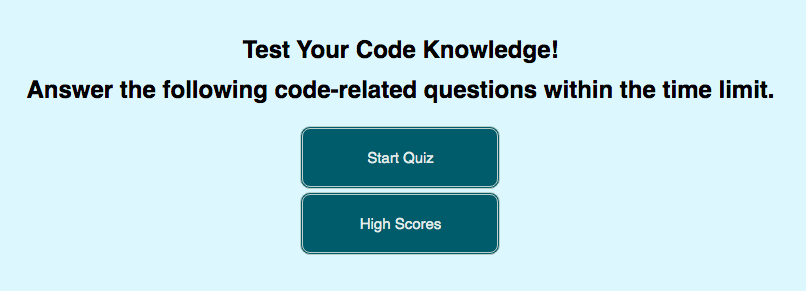

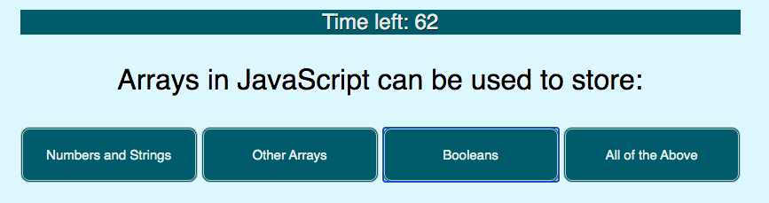

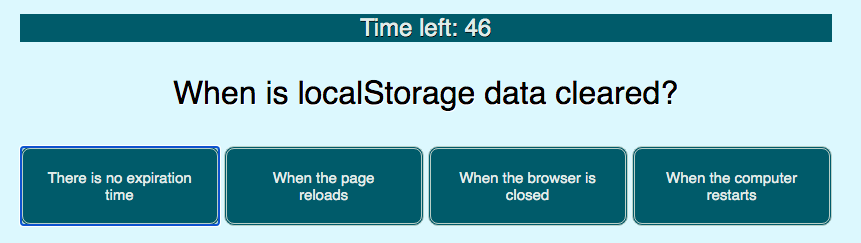

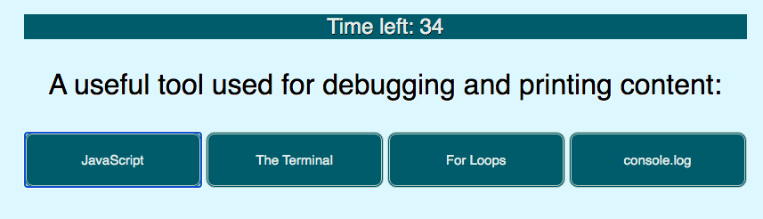

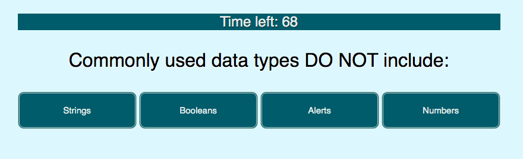

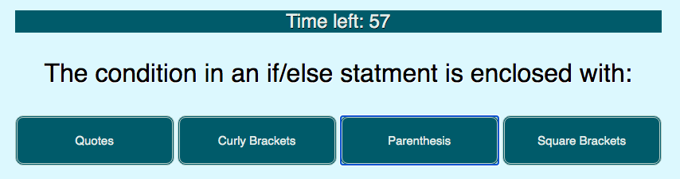

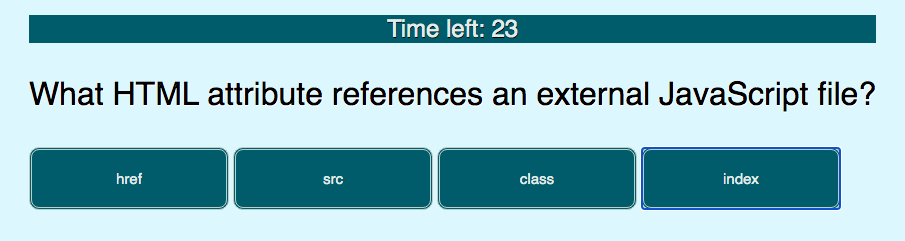

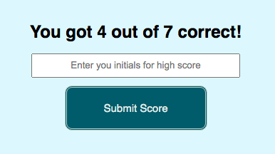

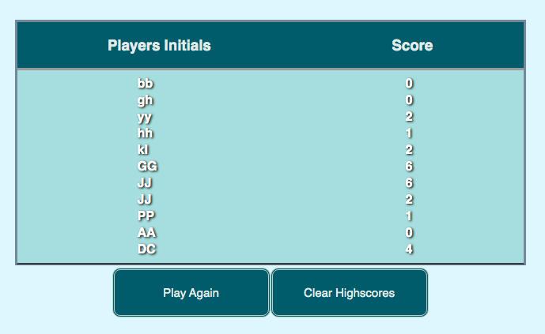

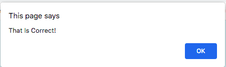

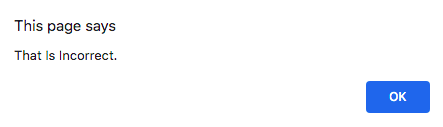

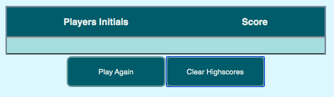

## Built With

Shout out to Tanetta J, Monica H, Paul C & Jess B

## Acknowledgments

[css-tricks.com](https://css-tricks.com/)

[w3schools.com](https://www.w3schools.com/)

[stackoverflow](https://stackoverflow.com/)

[BULLDOGJOB.com](https://bulldogjob.com/news/449-how-to-write-a-good-readme-for-your-github-project)

[code.visualstudio.com](https://code.visualstudio.com/docs/languages/markdown)

## Created with:
HTML, CSS, JavaScript

### Quiz Rules
Coding Quiz Challenge
Try to answer the following code-related questions within the time limit.
Keep in mind that your time will run out!

Start Quiz

### Quiz Questions
* Question: Commonly used data types DO NOT include:
  - A: Strings
  - B: Booleans
  - C: Alerts
  - D: Numbers
  - Answer: C
  
* Question: The condition in an if/else statment is enclosed with:
  - A: Quotes
  - B: Curly Brackets
  - C: Parenthesis
  - D: Square Brackets
  - Answer: B
   
* Question: Arrays in JavaScript can be used to store:
  - A: Numbers and Strings
  - B: Other Arrays
  - C: Booleans
  - D: All of the Above
  - Answer: D
    
* Question: String values must be enclosed within ____ when being assigned to variables.
  - A: Commas
  - B: Curly Brackets
  - C: Quotes
  - D: Parenthesis
  - Answer: C
    
* Question: When is localStorage data cleared?
  - A: There is no expiration time
  - B: When the page reloads
  - C: When the browser is closed
  - D: When the computer restarts
  - Answer: A
    
* Question: A useful tool used for debugging and printing content:
  - A: JavaScript
  - B: The Terminal
  - C: For Loops
  - D: console.log
  - Answer: D
    
* Question: What HTML attribute references an external JavaScript file?
  - A: href
  - B: src
  - C: class
  - D: index
  - Answer: B